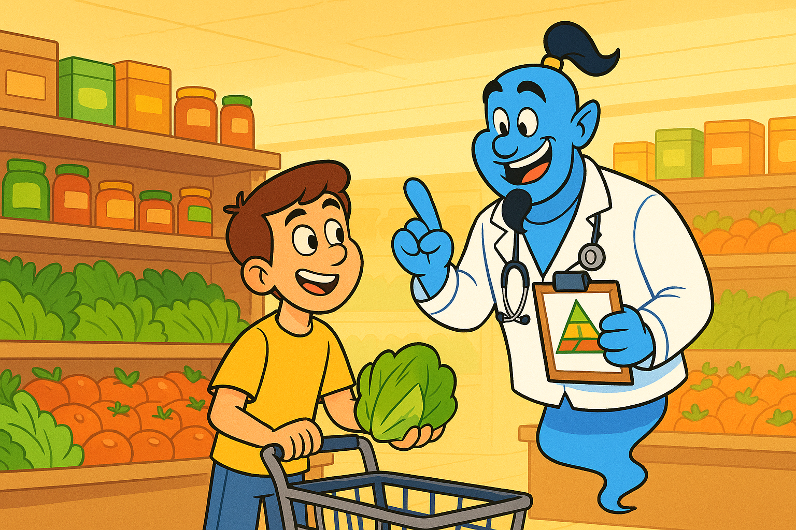

# FODMAP Food Helper

A friendly, AI-powered grocery shopping assistant designed to help people with irritable bowel syndrome (IBS) or anyone following a low FODMAP diet. Imagine having a knowledgeable genie by your side, ready to answer your food questions, provide FODMAP ratings, and offer practical shopping tips so you can shop and eat with confidence.

## Setup Instructions

### Backend Setup

Install dependencies:

```
cd packages/api
npm install
```

Start the API server (local dev):

```
node local-server.js
```

Or, to run with Azure Functions Core Tools:

```
npm run start
```

### Frontend Setup

Install dependencies:

```
cd packages/webapp
npm install
```

Start the development server:

```
npm start
```

## Usage

Type your message in the chat interface and press Enter or click Send.
The message will be sent to the backend API, which will process it through the AI model and return a response.

💬 **Example Questions You Could Ask It:**

- Is banana low FODMAP?
- What breads are safe for someone with IBS?
- Can I eat hummus on a low FODMAP diet?
- What snacks can I buy at the grocery store?
- Are avocados high or low FODMAP?
- What are some good low FODMAP breakfast ideas?
- Can I use almond milk?
- What should I avoid in the produce section?
- Are there any low FODMAP fruits I can try?
